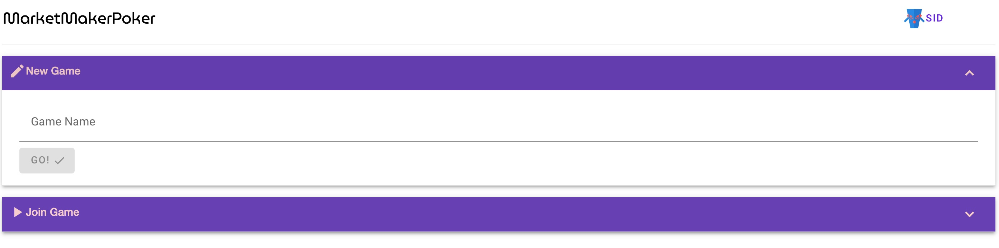
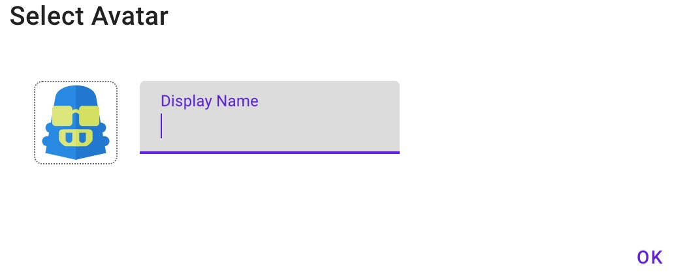
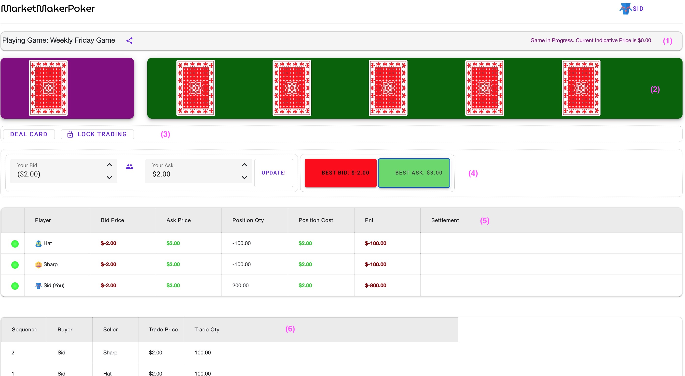

# Market Maker Poker
---

## Introduction

Market Maker Poker is a multi-player game to  sharpen your market making skills in a familiar card game setting. The game is similar to Texas Hold'em with one private card dealt for each player and five community cards to be shared by all players.  Each card has a numerical value and the final objective of the game is to estimate the sum total of all cards dealt -- the community cards and all the private cards. At each round of the game every player can set two sided 'quotes' which other players can 'trade' against, thus expressing their opinion with a 'position'.

## Game Rules

- **Card Values**: 
Each card has a numerical value equal to its sequential number (Ace = 1, ... Queen = 12, King = 13). However, red cards have a negative value. So a King of Spades or Clubs is 13 but King of Hearts or Diamonds is -13. Hence, the sum total of a complete deck of cards is 0.

- **Rounds**: 
Initially the Dealer will deal a private card to each participant player. In subsequent rounds, each one of the five community cards will be dealt. The game can be finished only after all private and community cards have been dealt at which point the results of the game are displayed.

- **Quoting**:
Anytime during the initial round and the five subsequent rounds and until the end of the game, players can set two sided quotes i.e. a Bid price at which they are willing to buy and an Offer price at which they are willing to sell. 

  - Quote size are of 100 lots per player. 

  - A new quoted Offer price must be greater than Bid price.

  - A new quoted Offer price can be at most 5 units greater than the quoted Bid price.

  - Multiple players are allowed to quote at the same price level. Each new player will increase the quote size on that price level by 100. i.e. if 3 players set the Bid price to 10 then the total quantity on price level 10 is 300.

  - Quotes cannot 'cross' with other players quotes i.e. a quoted Bid price cannot be greater than the current best Offer price or the Ask price cannot be less than current best Bid price. 

  - If a quote is set such that it crosses, then it will trade against the price levels to avoid crossed quotes. For instance lets say currently there are two players with Bid price of 10 and one player with Bid price of 20 and Player-A wants to set their Offer price to 5 then Player-A will sell 200 lots at 20, and 100 lots 10 and then set the new Offer to 5 (same rules apply to a new Bid price that crosses)

- **Trading**:
Players can trade against the quotes set by other players. They can buy at the best (the least) Offer price or the best (the highest) Bid price. 

  - A player can only trade if they have set quotes.

  - A trade request at a price level will *exhaust* all quantity at that level. For instance, lets say there are 3 players who have currently set a Bid price of 10 and thats the best Bid (highest) price. If Player-A sends a request to sell at best Bid price of 10, then they will sell 300 lots at price 10.

- **Statistics**:
  - The players are shown every other players quote prices as well as the best Bid and best Offer prices.

  - The players are also shown their position quantity (total traded quantity) and position price (weighted average trade price), and their current PnL (profit/loss) using the best Bid or best Offer price.

  - The players can view detailed trade activity which includes the players involved in trade, the trade price and quantity.

- **Dealer Actions**:
  - The dealer can *deal* a community card at any time. A player can see the sum of total of only theur private card and community cards. They are not revealed the other private cards or their totals.

  - The dealer at any time can *lock* Trading. This will disallow sending trade requests as well as setting quotes that would end up crossing and trading against other quotes. This function can be used before dealing a new card so that players have a chance of updating their quotes.

- **Settlement**:
Once the private cards for each player and all the five community cards have been dealt, the dealer can choose to finish the game. 

  - This operation will reveal every players private cards and the final settlement price, calculated as the sum total of all private and community cards.

  - At this point the final Settlement PnL is calculated and displayed. For e.g. if a Player-A has a position of 100 lots with a position price of 2, and the Settlement price is 5 then Player-A grossed a Settlement Profit of 300.

## Instructions

### Create New Game

The game can be accessed [here](https://marketmakerpoker.sidhat.com/). The main screen provides options for creating a new game or joining a previously created game. After creating the game, the screen will navigate to join and play the game. The creator of the game is the dealer and controls the game.

### Select Display Name

Before joining a game you will be asked to select a Display Name and Avatar.

### Play Game

#### Sections

##### 1. Game Info

Shows the name of the game being played, status and the current indicative price which is the sum of cards visible only to you - the community card and your private card. (The private cards of other players will only be revealed once the game is finished)

##### 2. Cards

Your private card is the first one, on a purple background. The five community cards are displayed on a green background. The cards will initially be unopened and will only be shown once they are dealt by the Dealer.

##### 3. Dealer Controls

This section will only be visible to the Dealer. It provides options to `Deal`, which will open the next card in the game, initially the private cards for all players and then the community cards. `Lock Trading` will disallow trading until its allowed (the default state). Typically this option can be used before opening the next card. This allows for the Dealer to provide time for players to refresh their quotes after a new card is opened. 

##### 4. Quoting and Trading

You can enter and set your Bid and Ask price which will be displayed to all players, and they can trade against them. The buttons on right allow you to either buy at the Best Ask or sell at the best Bid. Note that if another player trades against you, your quotes will be blanked out to provide you the chance to update them. 

##### 5. Players

Shows information for all players including you in a table. Icons on left indicate if a player is currently connected. The position quantity and price columns are updated as players make trades. While the game is in progress, the PnL displayed will use the Best Bid and Best Ask prices. After the game is finished, the final Settlement Price (sum of value of all cards) will be used. The Settlement column will be populated will reveal all players private card after the game is marked Finished by the Dealer.

##### 6. Trades

Shows the list of trades that have occured till now in the game. This list can be scrolled using the paging control at bottom.

### Adding Players to a Game

Once you have created a game, you can click the share icon next to the name of the game at top to copy the game URL. You can share this link with other players to allow them to join the game.
